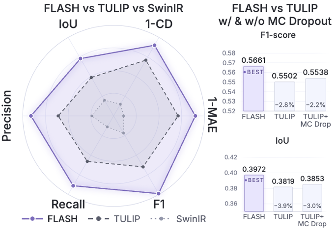
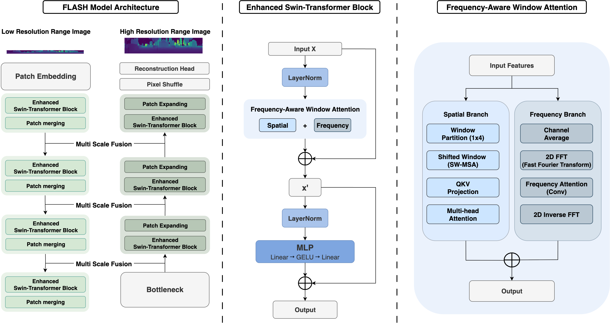
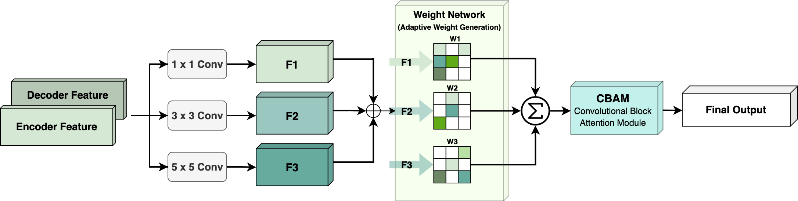
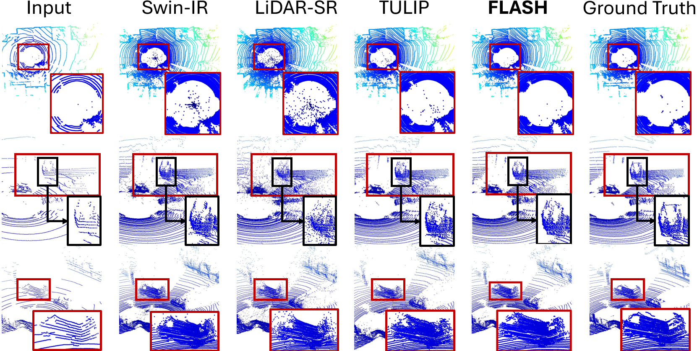

<div align="center">

# FLASH: Real-Time LiDAR Super-Resolution via Frequency-Aware Multi-Scale Fusion

**June Moh Goo, Zichao Zeng, Jan Boehm**

Dept. of Civil, Environmental and Geomatic Engineering, University College London

[](https://ieeexplore.ieee.org/abstract/document/11630360)
[](https://arxiv.org/abs/2511.07377)



</div>

## Overview

**FLASH** (**F**requency-aware **L**iDAR **A**daptive **S**uper-resolution with **H**ierarchical fusion) is a **dual-domain** framework for LiDAR range-image super-resolution. Unlike prior spatial-only transformers such as TULIP, FLASH processes both the **spatial** and the **frequency** domain, capturing fine-grained geometry and periodic scanning patterns at log-linear cost. It reaches **state-of-the-art accuracy on KITTI** in a **single deterministic pass** at **real-time speed (66 FPS, 15 ms)** — beating even uncertainty-enhanced baselines that need many forward passes.

### Highlights

- **Dual-domain processing** — combines local spatial window attention with global frequency-domain (FFT) analysis.
- **Two key modules:**
  - **Frequency-Aware Window Attention (FA):** spatial window attention **+** a global frequency branch via FFT, fused with a learnable weight.
  - **Adaptive Multi-Scale Fusion (MSF):** replaces plain skip concatenation with position-specific, multi-scale (1×1/3×3/5×5) feature aggregation, refined by CBAM attention.
- **Real-time & single-pass** — 66 FPS / 15 ms, vs 7.5 FPS for TULIP with Monte-Carlo Dropout, while being **more accurate**.
- **Implicit uncertainty handling** — the frequency branch suppresses noise without stochastic inference.
- **State of the art on KITTI** across all reconstruction metrics.

## Method

<div align="center"></div>

FLASH is a Swin-Transformer U-Net for range images (16×1024 → 64×1024, 4× vertical upsampling), built on the TULIP backbone with two additions at every block and every skip connection:

**Frequency-Aware Window Attention (FA).** Each block runs a spatial window-attention branch in parallel with a frequency branch. The frequency branch takes the 2D FFT, applies a learned spectral gate, and returns via the inverse FFT. The two branches are combined as
`Output = Attention_spatial + α · FreqBranch(X)`, with `α` initialised to 0.1 and learned.

**Adaptive Multi-Scale Fusion (MSF).** At each skip connection, encoder and decoder features are combined and passed through three parallel convolutions (1×1, 3×3, 5×5); a softmax network predicts position-specific fusion weights, and CBAM refines the result.

<div align="center"></div>

## Results

**KITTI (16×1024 → 64×1024, 4× upsampling).** MAE and Chamfer distance (CD) lower is better; voxel IoU / F1 higher is better.

| Method | MAE ↓ | CD ↓ | IoU ↑ | F1 ↑ |
|:--|:--:|:--:|:--:|:--:|
| LiDAR-SR | 0.7947 | 0.2992 | 0.2089 | 0.3433 |
| SwinIR | 0.5776 | 0.1874 | 0.3627 | 0.5300 |
| TULIP | 0.4354 | 0.1342 | 0.3819 | 0.5502 |
| **FLASH (Ours)** | **0.3899** | **0.1161** | **0.3972** | **0.5661** |

**Performance by distance range.** FLASH is best at both near and far range, with the largest relative gains in the harder far range (30–60 m).

| Method | Range | MAE ↓ | CD ↓ | IoU ↑ | F1 ↑ |
|:--|:--|:--:|:--:|:--:|:--:|
| SwinIR | Near (0–30 m) | 0.299 | 0.059 | 0.394 | 0.563 |
| LiDAR-SR | Near (0–30 m) | 0.443 | 0.118 | 0.229 | 0.371 |
| TULIP | Near (0–30 m) | 0.255 | 0.049 | 0.418 | 0.587 |
| **FLASH (Ours)** | Near (0–30 m) | **0.239** | **0.041** | **0.434** | **0.603** |
| SwinIR | Far (30–60 m) | 3.064 | 2.921 | 0.092 | 0.168 |
| LiDAR-SR | Far (30–60 m) | 4.149 | 5.347 | 0.010 | 0.019 |
| TULIP | Far (30–60 m) | 2.302 | 2.196 | 0.091 | 0.167 |
| **FLASH (Ours)** | Far (30–60 m) | **2.045** | **1.911** | **0.105** | **0.189** |

**Efficiency vs. uncertainty modelling.** FLASH beats TULIP with Monte-Carlo Dropout (20 samples) in accuracy while running **~9× faster** in a single pass.

| Method | MC Dropout | MAE ↓ | CD ↓ | IoU ↑ | F1 ↑ | Time (ms) ↓ |
|:--|:--:|:--:|:--:|:--:|:--:|:--:|
| TULIP |  | 0.4354 | 0.1342 | 0.3819 | 0.5502 | 14 |
| TULIP | ✓ | 0.4070 | 0.1250 | 0.3853 | 0.5538 | 134 |
| **FLASH (Ours)** |  | **0.3899** | **0.1161** | **0.3972** | **0.5661** | **15** |

**Ablation — contribution of each module.**

| MSF | FA | MAE ↓ | CD ↓ | IoU ↑ | Pre ↑ | Re ↑ | F1 ↑ |
|:--:|:--:|:--:|:--:|:--:|:--:|:--:|:--:|
|  |  | 0.4392 | 0.1348 | 0.3678 | 0.5355 | 0.5356 | 0.5355 |
| ✓ |  | 0.3904 | 0.1209 | 0.3721 | 0.5433 | 0.5368 | 0.5400 |
| ✓ | ✓ | **0.3899** | **0.1161** | **0.3972** | **0.5708** | **0.5617** | **0.5661** |

Both modules contribute; adding FA on top of MSF gives the largest IoU jump (0.372 → 0.397). At runtime FLASH reaches **66 FPS**.

### Qualitative comparison

<div align="center"></div>

Three challenging KITTI scenarios: **(1) noise suppression** around the sensor-mounting region (LiDAR-SR sprays spurious points, TULIP leaves scattered artifacts, FLASH stays clean); **(2) edge preservation** on large vehicles (baselines blur or smooth the boundaries, FLASH keeps sharp discontinuities); **(3) fine-detail recovery** of a van's rear-window frame.

## Getting Started

### Installation
```bash
git clone https://github.com/junegoo94/FLASH.git && cd FLASH
conda create -n flash python=3.9 -y && conda activate flash
pip install -r requirements.txt
```

### Data
FLASH trains on paired low-/high-resolution range images (`.npy`, one range value per pixel, in metres). Arrange each split as flat directories of paired files (same filename in both):
```
data/kitti/
├── train/{low_res, high_res}/*.npy     # low_res: 16×1024, high_res: 64×1024
└── val/{low_res, high_res}/*.npy
```
KITTI is 16×1024 → 64×1024 (4× vertical). See the [TULIP](https://github.com/ethz-asl/TULIP) preprocessing for building range images from raw KITTI.

### Pretrained checkpoints
```bash
wget https://huggingface.co/jmgoo1118/FLASH/resolve/main/flash_kitti.pth
```
See [CHECKPOINTS.md](CHECKPOINTS.md) for details.

### Inference
Super-resolve a low-resolution range image and back-project it to a point cloud:
```bash
python inference.py \
    --checkpoint flash_kitti.pth \
    --input path/to/low_res.npy \
    --dataset kitti \
    --out_dir out --save_ply
```
Outputs `out/<name>_sr.npy` (high-resolution range image, metres) and, with `--save_ply`, `out/<name>_sr.ply`.

### Training
```bash
python train.py \
    --dataset kitti \
    --data_root data/kitti \
    --batch_size 16 --epochs 600 --lr 1.5e-4 \
    --output_dir checkpoints/
```
`train.py` trains the full FLASH model (Frequency-Aware attention + Multi-Scale Fusion). The L1 log-range loss is computed inside the model. Checkpoints are written every `--save_every` epochs.

## Citation

If you find this work useful, please cite:

```bibtex
@article{goo2025flash,
  title   = {Real-Time LiDAR Super-Resolution via Frequency-Aware Multi-Scale Fusion},
  author  = {Goo, June Moh and Zeng, Zichao and Boehm, Jan},
  journal = {arXiv preprint arXiv:2511.07377},
  year    = {2025}
}

@INPROCEEDINGS{11630360,
  author={Goo, June Moh and Zeng, Zichao and Boehm, Jan},
  booktitle={2026 IEEE International Conference on Image Processing (ICIP)}, 
  title={Flash: Real-Time Lidar Super-Resolution Via Frequency-Aware Multi-Scale Fusion}, 
  year={2026},
  volume={},
  number={},
  pages={1-6},
  keywords={Laser radar;Superresolution;Timing;Printing;Distance measurement;Frequency;Windows;Transformers;Conferences;Learning (artificial intelligence);Lidar super-resolution;Range sensing;Perception;Point Clouds;Deep learning},
  doi={10.1109/ICIP61757.2026.11630360}}

```

IEEE Xplore: https://ieeexplore.ieee.org/abstract/document/11630360 · arXiv: https://arxiv.org/abs/2511.07377

## Acknowledgements

This work was supported by the EPSRC through an industrial CASE studentship with Ordnance Survey (EP/X524840/1, EP/W522077/1). The backbone builds on TULIP (Yang et al., CVPR 2024).
